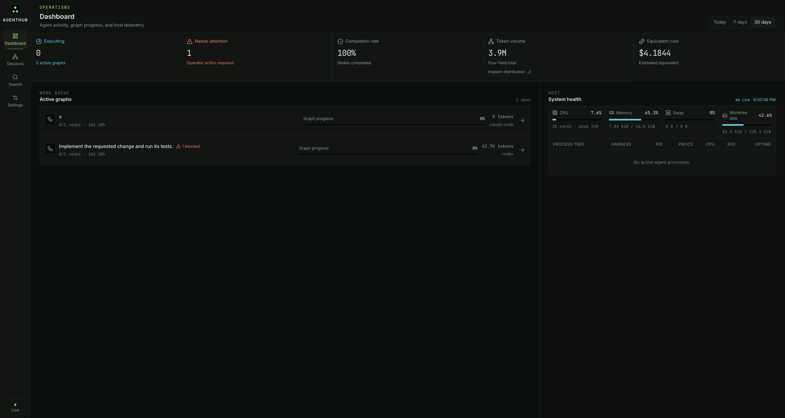
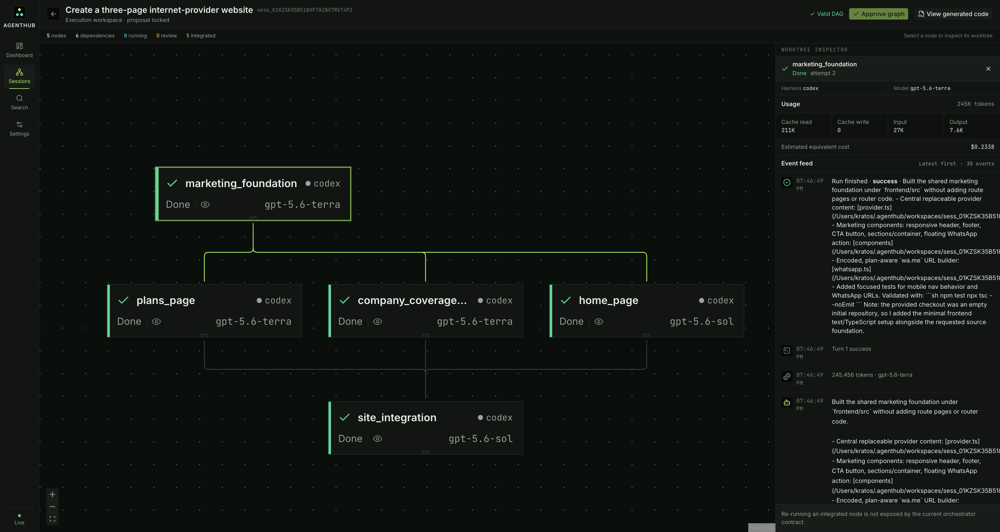
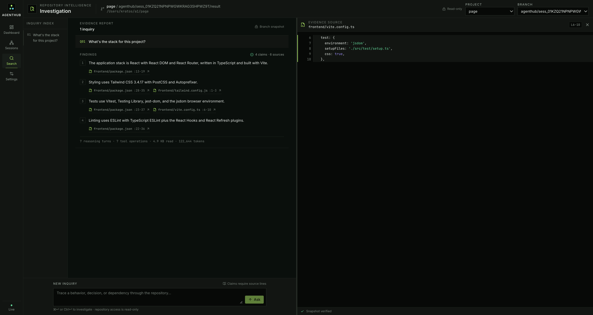
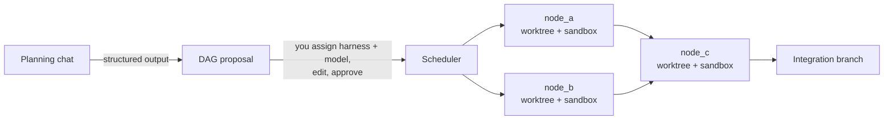

# AgentHub

**A local orchestrator for AI coding agents.** Describe a goal, get a dependency
graph of activities, assign a harness and model to each node, and run them in
parallel — each agent sandboxed, each in its own git worktree, all of it streamed
back with live output, tool calls, and token accounting.

---

## Project status

**Development was discontinued in August 2026.** The MVP is complete and the
repository remains available as a study and reference project, but no further
features, maintenance, or support are planned.

This is not a claim that multi-agent systems never work. They can be effective
when a valuable problem splits into genuinely independent work, as Anthropic's
research system demonstrates. It is a decision about the fit between AgentHub's
complexity, its coding-orchestration use case, and the value it would provide to
its author:

- [*Don't Build Multi-Agents*](https://cognition.com/blog/dont-build-multi-agents)
  describes how parallel agents fragment context and make implicit, conflicting
  decisions. Those are especially difficult failure modes when agents modify the
  same codebase.
- [*Measuring Agents in Production*](https://arxiv.org/abs/2512.04123) finds
  that deployed agents tend to use simple, controllable designs and identifies
  reliability as practitioners' leading challenge.
- [*How we built our multi-agent research system*](https://www.anthropic.com/engineering/multi-agent-research-system)
  reports strong results for broad, parallel research, while also reporting much
  higher token use and warning that tasks with shared context or many
  dependencies—including most coding tasks—are a poor fit today.

AgentHub addressed some of these problems deliberately with dependency graphs,
isolated worktrees, review gates, replayable events, and explicit accounting.
That also made it a substantial system to operate and maintain. Without a
recurring personal use case, continuing to invest in that complexity would not
be justified.

The project was nevertheless successful as a learning journey. Building it
provided practical experience with agent harnesses, context and event design,
async orchestration, process isolation, git worktrees, deterministic replay,
token accounting, graph scheduling, code search, and a real-time React/FastAPI
application. Finishing the MVP and deciding not to turn it into a maintained
product are compatible outcomes.

## Screenshots

**Dashboard.** Usage and estimated-equivalent cost, active graph progress, and
live host telemetry in one operational view.



**Session graph and run inspector.** An approved DAG with parallel branches,
per-node harness and model assignments, four-field token usage, and the event
feed for the selected worktree.



**Code Search.** A branch-scoped investigation whose findings link back to the
exact source files and line ranges used as evidence.



## The idea

Running one coding agent is easy. Running five at once against the same repository
is where it falls apart: they overwrite each other's edits, you can't audit the
diff, you can't tell which one burned 400K tokens, and you can't see what any of
them is actually doing.

AgentHub treats the **dependency graph as the unit of execution**, not as a
picture drawn next to a task list:



Each node gets its own git worktree branched off the merge of its parents, so
parallel agents produce independent, reviewable diffs. Each node runs under
[ai-jail](https://github.com/akitaonrails/ai-jail), an OS-level sandbox
(bubblewrap + Landlock on Linux, seatbelt on macOS) — not containers, so startup
is in milliseconds and harness auth keeps working.

Nothing executes before you approve the graph.

## Four surfaces

| Tab | What it does |
|---|---|
| **Dashboard** | Token and cost KPIs, system health (CPU, RAM, disk, per-agent process tree), **active** sessions |
| **Sessions** | Planning chat, graph orchestration, per-node drawer: edit before running, message the agent while running, review the diff after. **All** sessions |
| **Code Search** | Agentic investigation of a known project's local branches through bounded, commit-pinned snapshots |
| **Settings** | Persistent Planner and Code Search runtime defaults, with API/spend and subscription/equivalent-cost choices kept explicit |

The structured harness channel remains the source of truth for state and tokens.
A real terminal (`xterm.js` over a PTY) is planned only for adapters that can
prove attachment to the same live runtime. Codex Channel B is currently
deferred; see [`docs/architecture.md`](docs/architecture.md#codex-attach-classification-validated-2026-08-06).

## Harnesses

Claude Code and Codex are the current adapters, behind a single contract.
OpenCode is planned. Every CLI normalizes into one `AgentEvent` stream, so
nothing downstream of the adapter layer knows which harness is running.

Adding one is a documented procedure: see
[`.claude/skills/add-harness/SKILL.md`](.claude/skills/add-harness/SKILL.md).

## Stack

**Backend** — Python 3.12+, FastAPI + asyncio, SQLite (WAL) + SQLModel, NDJSON
event log, uv, ruff, mypy.

**Frontend** — Vite + React 19 + TypeScript, shadcn/ui on Base UI + Tailwind,
TanStack Query + Zustand. Graph, terminal, and chart packages land with the
phases that first use them.

**Isolation** — ai-jail for the process sandbox, git worktrees for workspace
isolation.

No Docker in the MVP. No Postgres. No auth — it binds to `127.0.0.1` and is meant
to run on your own machine.

## Installation

All five phases are runnable from this checkout: planner graphs, the concurrent
scheduler, kill/retry, manual approval, diff inspection, deterministic replay,
the dashboards, and code search.

### Requirements

- macOS (the accepted path; Linux sandbox support is not yet accepted here)
- Python 3.12+ and [uv](https://github.com/astral-sh/uv)
- Node 20+ and pnpm
- [ai-jail](https://github.com/akitaonrails/ai-jail)
- Git
- [ripgrep](https://github.com/BurntSushi/ripgrep) — code search's text tool
- An installed and authenticated Codex or Claude Code CLI
- **No API key.** The planner runs through an already-authenticated harness CLI
  by default, so a Claude Max/Pro plan is enough for the whole product. See
  *The planner's backend* below if you would rather it called the API.
- Optional: [ast-grep](https://ast-grep.github.io/), for structural search.
  Without it that one tool reports itself unavailable and the rest still works.

> **Verify `rg` is a real binary, not a shell function.** Some shells and
> terminal integrations define `rg` as a function or alias, so `which rg` and
> `rg --version` both succeed while `subprocess` — which does not go through the
> shell — cannot find it. Check with `ls -l "$(command -v rg)"`: it must be a
> file. This masked a missing ripgrep on the development machine for the whole
> of Phase 4.

Install the locked dependencies:

```bash
git clone https://github.com/zBrant/agent-hub.git
cd agent-hub

cd backend
uv sync

cd ../frontend
pnpm install
```

Run the backend and frontend in separate terminals from the repository root:

```bash
# terminal 1
cd backend
uv run agenthub serve

# terminal 2
cd frontend
pnpm dev
```

Open <http://127.0.0.1:5173>. Both servers bind only to loopback. The Vite
server proxies `/api` and `/ws` to AgentHub on `127.0.0.1:8000`.

### Create and run a session

There are two ways in.

**From the UI.** Open the **Sessions** tab, describe an objective, and select
*Create proposal*. The planner turns it into a graph and persists it `pending`;
invariant 6 means nothing runs until you approve it.

**From the resource API**, when you would rather write the activity yourself
than ask a model for one. Replace
`/absolute/repo` with an existing Git repository — an absolute path to a real
working tree, or the call answers 422 and names what it could not resolve:

```bash
curl --request POST http://127.0.0.1:8000/api/sessions \
  --header 'Content-Type: application/json' \
  --data-binary @- <<'JSON'
{
    "repo_path": "/absolute/repo",
    "prompt": "Implement the requested change and run its tests.",
    "harness": "codex",
    "model": "gpt-5.6-terra",
    "auto_merge": false,
    "requires_review": true
}
JSON
```

`harness` is `codex` or `claude-code`, and `model` has to be one the adapter
declares — `gpt-5.6-sol`, `gpt-5.6-terra`, `gpt-5.6-luna` for Codex;
`claude-opus-5`, `claude-sonnet-5`, `claude-haiku-4-5` for Claude Code. Anything
else is a 422 that lists what was expected.

Creating a session does not start it. Either open `/sessions/<session_id>` in
the frontend, or start it over HTTP with the id from the response:

```bash
curl --request POST http://127.0.0.1:8000/api/sessions/<session_id>/runs
```

The page exposes start, kill, retry, approval, event history, all four token
fields, estimated equivalent cost, and the final diff. `auto_merge=false` keeps
the human gate available, while `requires_review` decides whether this node
actually stops at `awaiting_review`; it defaults to `true`. Graph proposals can
set that flag independently on every node. A graph can also reserve a durable
final branch before planning starts. When all nodes finish, AgentHub points that
branch at the integration result without switching the target repository's
checkout; omitted names retain the `agenthub/<session>/result` fallback.

### The planner's backend

Planner and Code Search each have two interchangeable AI backends
(`design.md` §8). Their global defaults live in **Settings**, are persisted in
SQLite, and apply immediately to new requests. Environment variables seed a
fresh database; after the first save, the UI-owned values remain authoritative.
The Sessions form can still override the planner for one unusually complex
graph. Credentials are never stored by this settings API.

**`harness` (default)** drives an already-authenticated CLI with
`--json-schema` (Claude Code) or `--output-schema` (Codex) and gets back
schema-validated content, not prose. Nothing to configure, no key, and the
planner's tokens are an *estimated equivalent* under your subscription like
every other run — invariant 7 applies to it too.

**`api`** calls the Anthropic API with `messages.parse`. It validates against
the Pydantic model in-process and reports refusals and truncation through
`stop_reason`, which no CLI exposes. It also needs a credential of its own and
its tokens are **real spend**:

```bash
export AGENTHUB_PLANNER_BACKEND=api
export ANTHROPIC_API_KEY=sk-ant-...
```

> A Claude **Max/Pro plan is not API access**, and `ant auth login` is
> organization and service-account auth — neither is a route from a
> subscription to the `api` backend. That is precisely why `harness` is the
> default. Choosing `api` means buying API credit separately from your plan.

The Settings page and Sessions override offer every installed harness that can
return structured content, plus the Anthropic API. Deployment defaults select
the planner harness with
`AGENTHUB_PLANNER_HARNESS` (default `claude-code`), optionally pin its model
with `AGENTHUB_PLANNER_HARNESS_MODEL`, and configure the API choices with
`AGENTHUB_PLANNER_API_MODELS`. Each attempt has a 120-second wall-clock limit;
set `AGENTHUB_PLANNER_TIMEOUT_S` to change it. A timed-out CLI process tree is
terminated and the request answers 504 instead of leaving the form pending.
Naming a default harness that cannot return structured content does not stop
the server: it is logged at startup and the planner answers 503 with the
reason, so the rest of the application keeps working.

Code Search now uses the same backend seam. Its default is the authenticated
Codex harness (`AGENTHUB_SEARCH_BACKEND=harness` and
`AGENTHUB_SEARCH_HARNESS=codex`), which returns one schema-constrained action per
short-lived CLI call while AgentHub alone executes the bounded search tools.
Set `AGENTHUB_SEARCH_HARNESS_MODEL` to pin a CLI model. The `api` choice uses
`AGENTHUB_SEARCH_MODEL` and requires `ANTHROPIC_API_KEY`; its usage is real
spend, whereas harness usage is estimated equivalent under the subscription.

Search first selects a project discovered from persisted sessions, then an
exact local Git branch. AgentHub materializes a read-only snapshot pinned to
that branch's commit, so a moving branch cannot mix revisions within an
answer. Projects are deduplicated by repository identity, internal node and
integration branches are hidden, and finalized result branches remain visible.
Current agent navigation uses bounded ripgrep, ast-grep, file reads, and
directory listings. The earlier session-worktree symbol and semantic indexes
are not consulted until they can obey this same project/branch snapshot scope.

### Runtime data and replay

By default AgentHub stores `agenthub.db`, NDJSON logs, and worktrees under
`~/.agenthub/`. Set `AGENTHUB_ROOT` before starting the backend to use another
location.

Stop active work before an offline repair, then rebuild one run's SQLite
projection from its source log:

```bash
cd backend
uv run agenthub replay <run_id>
```

Use `--root /path/to/root` when the server ran with a non-default root. Replay
preserves authored sessions/nodes and uses the price-table version pinned at
ingest; it refuses rather than silently repricing when that table is missing.

### Verification

```bash
cd backend
uv run ruff format --check .
uv run ruff check .
uv run mypy app
uv run pytest
uv run lint-imports

cd ../frontend
pnpm test
pnpm typecheck
pnpm lint
pnpm build
pnpm gen:api --check
```

The real Codex HTTP/WebSocket/kill/retry/replay evidence is committed in
[`docs/acceptance-phase-1.md`](docs/acceptance-phase-1.md).

## A note on cost

When a harness runs under a Claude Max/Pro subscription there is no per-token
billing. AgentHub still counts tokens — all four fields, including `cache_read`,
which is 90%+ of a long agentic session — but labels the result **"estimated
equivalent cost"** rather than spend. A number that alarms without meaning
anything is worse than no number.

## Documentation

| Document | Answers |
|---|---|
| [`design.md`](design.md) | **What** to build and why — the full design: isolation, harness channels, token accounting, data model, the three tabs, the scheduler |
| [`docs/architecture.md`](docs/architecture.md) | **How** the code is organized — layers, the `AgentEvent` boundary, pure core / imperative shell, persistence, testing strategy |
| [`docs/conventions.md`](docs/conventions.md) | Python and TypeScript standards, naming, commits, security |
| [`docs/design-system.md`](docs/design-system.md) | Tokens, density, node states, terminal theme, accessibility |
| [`docs/acceptance-phase-1.md`](docs/acceptance-phase-1.md) | Real Phase 1 HTTP, WebSocket, retry, replay, and totals evidence |
| [`docs/roadmap.md`](docs/roadmap.md) | What is built, what isn't, and what comes next |
| [`CLAUDE.md`](CLAUDE.md) | The eight invariants, for humans and agents alike |

The repository ships its own agent configuration in
[`.claude/`](.claude) — four subagents (`orchestrator`, `harness-integrator`,
`ui`, `reviewer`) and two skills. AgentHub is built the way it expects you to
build with it.

## License

[MIT](LICENSE) © 2026 Eduardo Brant
