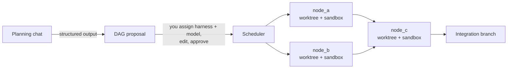

# AgentHub

**A local orchestrator for AI coding agents.** Describe a goal, get a dependency
graph of activities, assign a harness and model to each node, and run them in
parallel — each agent sandboxed, each in its own git worktree, all of it streamed
back with live output, tool calls, and token accounting.

---

## The idea

Running one coding agent is easy. Running five at once against the same repository
is where it falls apart: they overwrite each other's edits, you can't audit the
diff, you can't tell which one burned 400K tokens, and you can't see what any of
them is actually doing.

AgentHub treats the **dependency graph as the unit of execution**, not as a
picture drawn next to a task list:

Each node gets its own git worktree branched off the merge of its parents, so
parallel agents produce independent, reviewable diffs. Each node runs under
[ai-jail](https://github.com/akitaonrails/ai-jail), an OS-level sandbox
(bubblewrap + Landlock on Linux, seatbelt on macOS) — not containers, so startup
is in milliseconds and harness auth keeps working.

Nothing executes before you approve the graph.

## Three surfaces

| Tab | What it does |
|---|---|
| **Dashboard** | Token and cost KPIs, system health (CPU, RAM, disk, per-agent process tree), **active** sessions |
| **Sessions** | Planning chat, graph orchestration, per-node drawer: edit before running, message the agent while running, review the diff after. **All** sessions |
| **Code Search** | Agentic search over your codebase — ripgrep, ast-grep, and tree-sitter symbols as *tools* an agent drives, not top-k RAG |

Every node can attach a real terminal (`xterm.js` over a PTY) to see exactly what
the harness CLI is showing, while a separate structured channel
(`--output-format stream-json`) remains the source of truth for state and tokens.

## Harnesses

Claude Code, Codex, and OpenCode in the MVP, behind a single adapter contract.
Every CLI normalizes into one `AgentEvent` stream, so nothing downstream of the
adapter layer knows which harness is running.

Adding one is a documented procedure: see
[`.claude/skills/add-harness/SKILL.md`](.claude/skills/add-harness/SKILL.md).

## Stack

**Backend** — Python 3.12, FastAPI + asyncio, SQLite (WAL) + SQLModel, NDJSON
event log, psutil, uv, ruff, mypy.

**Frontend** — Vite + React 19 + TypeScript, shadcn/ui on Base UI + Tailwind,
`@xyflow/react` + ELK.js for the graph, `xterm.js` for terminals, Tremor for
charts, TanStack Query + Zustand.

**Isolation** — ai-jail for the process sandbox, git worktrees for workspace
isolation.

No Docker in the MVP. No Postgres. No auth — it binds to `127.0.0.1` and is meant
to run on your own machine.

## Installation

> Not installable yet — the Phase 0 backend spike is complete and the Phase 1
> application entry point and UI are now being built. See
> [`docs/roadmap.md`](docs/roadmap.md).

### Requirements

- macOS (Linux should work; the sandbox path is validated on Darwin)
- Python 3.12+ and [uv](https://github.com/astral-sh/uv)
- Node 20+ and pnpm
- [ai-jail](https://github.com/akitaonrails/ai-jail)
- `git`, `ripgrep`, `ast-grep`
- At least one agent CLI installed and authenticated (Claude Code, Codex, or
  OpenCode)

## A note on cost

When a harness runs under a Claude Max/Pro subscription there is no per-token
billing. AgentHub still counts tokens — all four fields, including `cache_read`,
which is 90%+ of a long agentic session — but labels the result **"estimated
equivalent cost"** rather than spend. A number that alarms without meaning
anything is worse than no number.

## Documentation

| Document | Answers |
|---|---|
| [`design.md`](design.md) | **What** to build and why — the full design: isolation, harness channels, token accounting, data model, the three tabs, the scheduler |
| [`docs/architecture.md`](docs/architecture.md) | **How** the code is organized — layers, the `AgentEvent` boundary, pure core / imperative shell, persistence, testing strategy |
| [`docs/conventions.md`](docs/conventions.md) | Python and TypeScript standards, naming, commits, security |
| [`docs/design-system.md`](docs/design-system.md) | Tokens, density, node states, terminal theme, accessibility |
| [`docs/roadmap.md`](docs/roadmap.md) | What is built, what isn't, and what comes next |
| [`CLAUDE.md`](CLAUDE.md) | The eight invariants, for humans and agents alike |

The repository ships its own agent configuration in
[`.claude/`](.claude) — four subagents (`orchestrator`, `harness-integrator`,
`ui`, `reviewer`) and two skills. AgentHub is built the way it expects you to
build with it.

## License

[MIT](LICENSE) © 2026 Eduardo Brant
