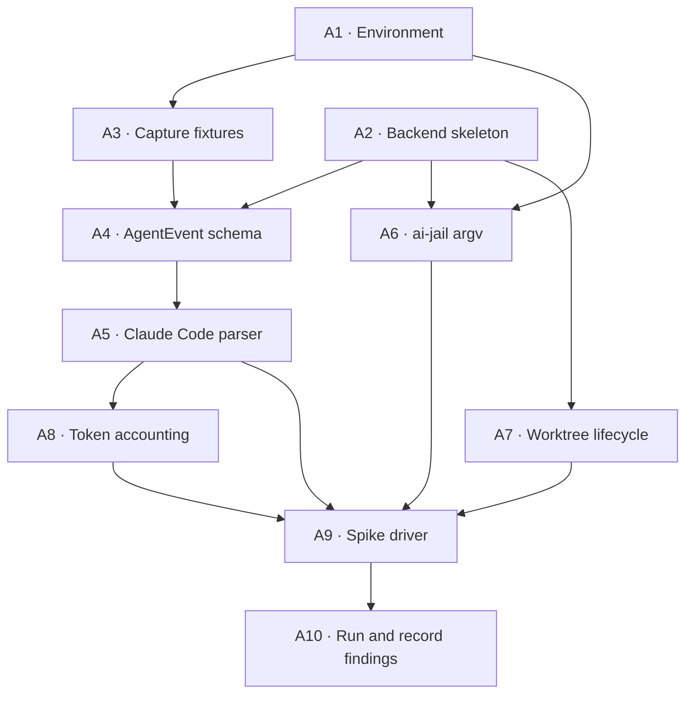

# Phase 0 — Vertical spike

**Goal:** prove the riskiest path end to end. Create a git worktree, run a real
harness inside a real sandbox, parse its structured output into `AgentEvent`,
count all four token fields, commit, and merge into the integration branch.

No UI, no FastAPI, no database. One driver script over real modules.

**The question this phase answers:** does the harness + PTY + worktree layer
behave the way `design.md` assumes? If it does, the product is viable. If it
doesn't, we find out in week 1 which flags and behaviors diverge from the
documentation — while changing course is still cheap.

## What is throwaway and what is not

The driver script (`backend/scripts/spike.py`) is throwaway; Phase 1 replaces it
with the scheduler. Everything it calls is not — the event schema, the parser,
the argv builder, and the worktree lifecycle land directly in the modules they
will live in permanently (`design.md` §11). Writing them in a scratch file and
"porting them later" means writing them twice and losing the fixtures.

## Activities



`A1` and `A2` are independent and can start in parallel. So can `A6` and `A7`
once the skeleton exists.

---

### A1 — Environment prerequisites

**Depends on:** nothing. **Blocks:** everything.

Three of the required tools are missing on this machine:

| Tool | State | Action |
|---|---|---|
| `claude` | 2.1.222 ✓ | none |
| `git` | 2.39.5 ✓ | none |
| `ripgrep` | 14.1.1 ✓ | none (needed in Phase 4) |
| `uv` | missing | install |
| Python | 3.9.6 (system) | `uv python install 3.12` |
| `ai-jail` | missing | build/install from source, Rust toolchain |

`ai-jail` is the one that carries risk. It must be verified on **macOS**
specifically, where it uses `sandbox-exec` (seatbelt) rather than the Linux
bubblewrap + Landlock path — a different and less-exercised code path.

**Done when:**

- `ai-jail --version` and `ai-jail --help` both respond.
- `ai-jail claude --version` runs Claude Code *through* the sandbox successfully.
- The flags `design.md` §2.1 assumes exist and are confirmed against `--help`:
  `--worktree`, `--mask`, `--deny-path`, `--no-docker`, `--no-gpu`.

**If it fails:** stop and report before writing any adapter code. A missing
`--worktree` flag or a broken seatbelt profile on Darwin changes the isolation
design, and that is a `design.md` §2 decision, not an implementation detail.

---

### A2 — Backend skeleton and tooling

**Depends on:** A1 (uv). **Blocks:** A4, A6, A7.

Create `backend/` per `design.md` §11 with the package directories in place, plus
the toolchain from `docs/conventions.md` §1: ruff, mypy (strict), pytest,
import-linter, structlog, Pydantic v2.

The import-linter contracts from `docs/architecture.md` §1 go in now, while there
is no code to violate them. Adding layer contracts after the fact means
retrofitting them around existing mistakes.

**Done when:** `uv sync`, `uv run ruff check`, `uv run mypy app`,
`uv run pytest` (zero tests passes), and `uv run lint-imports` all succeed.

---

### A3 — Capture real Claude Code fixtures

**Depends on:** A1. **Blocks:** A4.

Follow `.claude/skills/add-harness/SKILL.md` step 2. Create a throwaway git repo,
run Claude Code in structured mode, record the raw NDJSON into
`backend/tests/fixtures/claude-code/`.

```bash
claude -p --output-format stream-json --input-format stream-json --verbose
```

Capture at minimum `simple_edit` and `tool_error`. `multi_turn` and `interrupted`
are Phase 1 concerns but cost almost nothing to record while set up.

Sanitize: strip home paths, tokens, keys.

**This activity comes before the schema on purpose.** The rule from the skill is
that a parser is never written from documentation. Version 2.1.222 is what we
are integrating against, not whatever the docs describe.

**Done when:** fixture files exist, are committed, and the raw shape of
`system/init`, `assistant`, `user`, and `result` lines is written down.

---

### A4 — `AgentEvent` schema

**Depends on:** A2, A3. **Blocks:** A5.

`backend/app/harnesses/events.py` — the discriminated union from `design.md` §3,
as Pydantic v2 models with a `type` literal.

Phase 0 needs `RunStarted`, `AssistantText`, `ToolCall`, `ToolResult`, `Usage`,
and `RunFinished`. `ThinkingDelta`, `Permission`, and `RawChunk` can be declared
but stay unexercised until Phase 1.

Reconcile against A3: anything Claude Code emits that has no home in the union is
a decision — generalize it into the event, or drop it deliberately. It must never
become a downstream conditional on the harness name (invariant 1).

**Done when:** every fixture line maps to a variant or to an explicit,
documented "ignored" list. Mypy strict passes.

---

### A5 — Claude Code parser and golden test

**Depends on:** A4. **Blocks:** A8, A9.

`backend/app/harnesses/claude_code.py`. Phase 0 only needs the read path —
`start` and `events`. `send`, `interrupt`, and `kill` come in Phase 1.

The translation table goes at the top of the file as a comment, per the skill.
Document the CLI version tested (2.1.222).

The golden test is the point of this activity: it is what will tell us when the
next Claude Code release changes the format.

**Done when:** `parse_stream(fixture)` produces a stable event list matching a
committed `.expected.json`, for every fixture from A3.

---

### A6 — ai-jail argv construction

**Depends on:** A1, A2. **Blocks:** A9.

`backend/app/sandbox/aijail.py`. A pure function: sandbox policy + harness argv →
`list[str]`. No subprocess call here, so it is trivially testable.

Invariant 8 is the whole point of this module: `--mask` and `--deny-path` are
mandatory. An empty policy must raise, not produce a permissive command line.
Secrets never go in argv (`docs/conventions.md` §6).

**Done when:** unit tests cover the default policy, and a test asserts that
building a sandbox with no masks raises.

---

### A7 — Worktree lifecycle

**Depends on:** A2. **Blocks:** A9.

`backend/app/orchestrator/worktree.py`, implementing `design.md` §2.2:
`create` (from a base ref), `commit`, `merge` into integration, `remove`.

Every git call goes through `asyncio.create_subprocess_exec` — invariant 5. A
synchronous `subprocess.run` here works fine in the spike and then stalls the PTY
stream in Phase 1, which is exactly the kind of bug that is invisible until it
isn't.

Merge conflict is a **return value**, not an exception — it becomes the node's
`blocked` state (`docs/architecture.md` §9).

**Done when:** tests against a temp repo cover create → commit → merge, plus the
conflict path returning `blocked`.

---

### A8 — Token accounting

**Depends on:** A5. **Blocks:** A9.

Accumulate the four fields from `Usage` events and compute `cost_usd` at ingest
against `pricing.yaml` (`design.md` §4, invariant 3).

The question only the fixtures can answer: **is `message.usage` cumulative or
incremental per assistant message?** Getting this wrong doubles or halves every
number the product will ever show. Verify by summing across the run and comparing
to the total Claude Code itself reports in its final `result` event.

**Done when:** a test asserts our computed totals equal the CLI's self-reported
totals for the A3 fixtures, and `pricing.yaml` exists with the three model IDs
from `design.md` §4.

---

### A9 — Spike driver

**Depends on:** A5, A6, A7, A8.

`backend/scripts/spike.py`. Takes a target repo path and a prompt, then:

1. Creates a worktree off the integration branch (A7)
2. Builds the sandboxed argv (A6) and launches the harness
3. Streams events (A5), printing text, tool calls, and a running token total (A8)
4. Commits the result and merges into integration (A7)

Also writes `events.ndjson` as it goes — invariant 4 starts here, not in Phase 1.
If the NDJSON written during the spike cannot be replayed into the same event
list, the write path is already wrong.

**Done when:** one command drives the full loop against a real repository and the
diff on the integration branch is the agent's work.

---

### A10 — Run it and record what diverged

**Depends on:** A9.

The deliverable of Phase 0 is not the script — it is the answer to "does this
work, and where was the design wrong?"

Run it against a real repository. Then write down, in this file or as edits to
`design.md`:

- Which assumed flags did not exist or behaved differently
- Whether usage is cumulative or incremental
- ai-jail behavior on macOS, especially with `--worktree`
- Whether anything forced a change to `AgentEvent`

`design.md` is the source of truth for decisions already made. If Phase 0 proves
one of them wrong, the fix is to change `design.md` — not to work around it in
the code.

**Done when:** the findings are committed and `docs/roadmap.md` marks Phase 0
complete.

## Findings log

Filled in as activities complete. A10 consolidates this into edits to
`design.md` where a decision turned out to be wrong.

### A1 — done

Installed: `uv` 0.12.1, Python 3.12.13 (via uv), `ai-jail` 1.16.0 (Homebrew tap
`akitaonrails/tap`; the formula only fetches a checksummed release binary — no
install-time code). Already present: `claude` 2.1.222, `git` 2.39.5,
`ripgrep` 14.1.1.

All five flags `design.md` §2.1 assumes exist, and the sandbox runs Claude Code
on macOS. Confirmed against the generated SBPL profile: it opens with
`(deny default)`, and `--mask` / `--deny-path` both land in it as real rules.

Divergences from `design.md` §2.1:

1. **`--exec` is required for Channel A, and §2.1 does not mention it.** By
   default ai-jail interposes a PTY proxy and a status bar between the harness
   and the caller. For structured `stream-json` output there must be nothing in
   between, so Channel A runs with `--exec`. Channel B (Phase 1) will want the
   default proxy mode instead — meaning the sandbox invocation is not a constant,
   it varies by channel.
2. **`--worktree` is already the default** (`--no-worktree` disables it), and
   Docker passthrough is already off by default. Passing `--worktree` and
   `--no-docker` explicitly is therefore redundant — but it stays, because §2.1's
   policy is default-deny *and always explicit*.
3. **`--no-gpu` is Linux-only.** On macOS it is a no-op.
4. **On macOS, `--mask` behaves like `--deny-path`.** The documented behavior is
   "replace with an empty file"; the seatbelt profile implements it as
   `(deny file-read* ...)`. The agent gets a permission error rather than an
   empty file. Protection is equivalent; observable behavior for the agent is
   not.
5. ai-jail warns on every macOS run that `sandbox-exec` is deprecated by Apple.
   Worth tracking as a risk (`design.md` §12) — the macOS containment path
   depends on an interface Apple has already marked legacy.

The ai-jail banner goes to **stderr**; stdout stays clean in both modes. Channel
A can read stdout without filtering, but must not merge stderr into it.

### A2 — done

Backend skeleton at `backend/`. `ruff` (including the `ASYNC` ruleset, which
guards invariant 5), `mypy --strict` on the core, `pytest` with the `harness`
marker, and three import-linter contracts — all green on an empty tree.

`pricing.yaml` added at the repo root. A model absent from the table yields
`cost_usd = null`, never zero.

### A6 — done

`app/sandbox/aijail.py`. An empty policy cannot be *constructed*, not merely
cannot be built into argv — validation is in `SandboxPolicy.__post_init__`.

Three further corrections to `design.md` §2.1's invocation, all verified against
real `--dry-run` output:

6. **`--no-save-config` is mandatory and missing from §2.1.** ai-jail writes a
   `.ai-jail` file into the cwd on every run — *even with `--clean`*. Inside a
   per-node worktree that file lands in the agent's diff, which breaks the
   premise of invariant 2 that the diff is the agent's work, and on the next run
   it feeds a stale policy back in.
7. **`--clean` is mandatory and missing from §2.1.** Without it, a `.ai-jail`
   committed in the target repository is read — and it can *weaken* the policy
   via `--mask-except` / `--deny-path-except`, from a directory the agent can
   write to. That is invariant 8 defeated by a file in the repo.
8. **`--mask '*.pem'` as written in §2.1 under-protects.** Globs are expanded at
   launch against files that already exist, and a single `*` does not cross
   directory boundaries: `*.pem` produced a rule for `top.pem` and left
   `sub/deep.pem` readable. Only `**/*.pem` covers the tree.

   The corollary §2.1 should state: **a secret file created *during* a run is
   not masked.** The SBPL rules are `(literal ...)` entries computed at launch,
   not a live pattern. Masking is a point-in-time snapshot.

9. **`--worktree` grants write access to the entire parent `.git`**, not just
   `.git/worktrees/<node>`. The profile contains
   `(allow file-write* (subpath ".../repo/.git"))`. A node needs this to commit,
   but it means an agent in `node_a` can write refs belonging to `node_b`. This
   is a §2.2 question and cannot be fixed in the argv builder — recorded here
   for A10.

`--` is *not* needed: ai-jail stops option parsing at the first positional, so
`ai-jail --mask .env claude --mask X` correctly passes the second `--mask` to
claude. Adding `--` is accepted and byte-identical, so the builder omits it.

### A7 — done

`app/orchestrator/worktree.py`, tested against real temp repos rather than
mocks — the whole risk of this activity is git behaving differently than
assumed, and a mock would have confirmed the assumption instead of testing it.

**`design.md` §2.2 has been corrected** rather than worked around:

10. **The documented branch scheme was impossible.** `agenthub/<sess>` as the
    integration branch and `agenthub/<sess>/<node>` as node branches cannot
    coexist — git refs are files, so `refs/heads/agenthub/sess1` blocks the
    creation of the directory `refs/heads/agenthub/sess1/`. Verified:
    `fatal: cannot lock ref 'refs/heads/agenthub/sess1/node_a'`. The integration
    branch is now `agenthub/<sess>/integration`, and `integration` is a reserved
    node id.
11. **"`base_ref` is the merge of the parent nodes' branches" is not a ref.**
    `git worktree add` takes one commit-ish. A multi-parent node is created off
    the first parent and the rest are folded in inside the fresh worktree.
12. **A conflicted merge is aborted, not left in place.** Leaving the shared
    integration worktree in `MERGING` would block every other node behind one
    human.

Behaviors pinned by tests because exit codes hide them: `git merge` exits 0 on
"Already up to date"; `git commit` exits 1 when nothing is staged, which is
indistinguishable from a real failure. Both are decided before invoking the
command. Also macOS-specific: `worktree list --porcelain` prints resolved paths,
so every comparison must resolve `/var` → `/private/var`.

Agent commits pin `user.name`/`user.email` explicitly. Without that, git falls
back to a gecos-derived identity and attributes agent work to the human.

## Explicitly out of scope

FastAPI, WebSocket, SQLite, Alembic, the planner, the DAG, concurrency, the
frontend, PTY / Channel B, Codex, and OpenCode. Phase 0 runs one node,
synchronously, from a terminal.
