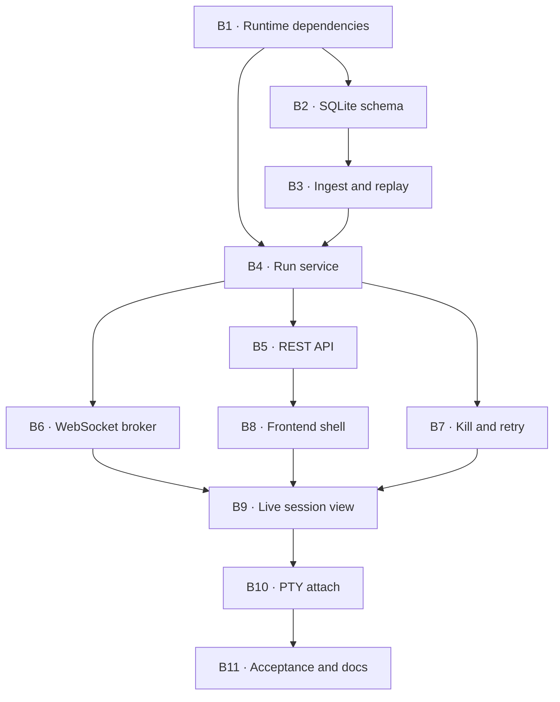

# Phase 1 — Single-node orchestrator

**Goal:** turn the proven one-shot spike into a persistent local application:
one session, one node, one active harness run, live structured events in the
browser, kill/retry, and deterministic replay from NDJSON into SQLite.

No planner and no graph scheduler yet. The single node is deliberately fixed so
this phase can prove lifecycle, persistence, reconnect, and failure semantics
before concurrency multiplies them.

## Activities

### B1 — Runtime dependencies and application entry point ✅

Add FastAPI, Uvicorn, aiosqlite/SQLModel, Alembic, and the CLI package entry
point. `app/main.py` must expose a health endpoint, initialize resources through
FastAPI lifespan, bind to `127.0.0.1`, and contain no orchestration logic.

**Done when:** the server starts, `/health` responds, OpenAPI is generated, and
the existing lint, type, import, and test gates remain green.

**Result:** completed on 2026-08-05. The installed `agenthub serve` command binds
only to `127.0.0.1`; a real Uvicorn process returned `200 OK` from `/health`, and
the OpenAPI contract plus lifespan are covered by tests. FastAPI, Uvicorn,
SQLModel, aiosqlite, Alembic, and settings support are locked in `uv.lock`.

### B2 — SQLite schema and migrations

Create the Phase 1 subset of the data model: session, node, run, and append-only
usage event. Enable WAL and foreign keys on every connection. Store event paths,
status, harness/model, timestamps, token fields, source, price-table version,
and ingest-time estimated equivalent cost.

**Done when:** Alembic builds an empty database and repository tests prove
foreign keys, WAL, append-only usage, and retry as multiple runs for one node.

### B3 — Ordered ingest and replay

Implement the required write order: NDJSON append → SQLite projection → event
broadcast. `agenthub replay <run_id>` must discard and rebuild only derived rows
from the log, producing the same run/node state and usage totals.

**Done when:** crash-boundary tests cover death after steps 1 and 2, and replay
is idempotent and byte-for-byte event compatible.

### B4 — Single-run application service

Replace the throwaway driver with an orchestrator service that creates the
session integration worktree and node worktree, selects an adapter through the
registry, streams into B3, checkpoints the node, and merges only a trusted
successful run. One active run per session is sufficient.

**Done when:** a fake adapter drives the complete lifecycle without HTTP, and
the service has no harness-name conditional.

### B5 — REST API

Expose the minimum resource API: create/get/list sessions, get the fixed node,
start a run, inspect run history, and retrieve the final diff. Routes validate
and delegate; all decisions stay in B4.

**Done when:** API tests cover success, invalid transitions, missing resources,
and a reconnect reading persisted state.

### B6 — WebSocket event broker

One `/ws` connection multiplexes `session:<id>` and `run:<id>` topics. Publish
events only after they are durable in NDJSON and projected in SQLite. Bound each
subscriber queue and make disconnect cleanup deterministic.

**Done when:** ordering tests prove a reconnect can fetch persisted state and
then continue without an event gap or duplicate.

### B7 — Kill and retry

Kill the process group, persist an interrupted terminal event, keep the failed
node branch for inspection, and create a new `Run` for retry. Never mutate the
old run into a retry.

Codex continuation (`codex exec resume <thread_id> -`) is a separate operation
from retry. Implement continuation only after the lifecycle states can represent
another process for the same logical run without losing event order.

**Done when:** tests cover kill during a tool, retry after failure, and refusal to
merge any interrupted or parser-untrusted run.

### B8 — Frontend shell and generated types

Create Vite + React + TypeScript strict, Tailwind v4, shadcn/Base UI foundations,
TanStack Query, Zustand, and one WebSocket client. Generate REST types from
OpenAPI; generate `AgentEvent` TypeScript from the canonical schema and commit
both outputs.

**Done when:** `pnpm typecheck`, Biome, and the generated-type drift check pass.

### B9 — Live session view

Implement the single-session route with node status, structured event feed,
token totals, equivalent cost, start/kill/retry controls, and final diff. The UI
must render `source="reconstructed"` usage distinctly and surface parser drift
as an unsafe run.

**Done when:** refresh/reconnect preserves state and a fake streamed run drives
the view through pending → running → done/failed/interrupted.

### B10 — PTY attach

Validate the Channel B design against the active Codex harness before building
the terminal. `codex exec --json` is non-interactive, so do not assume a second
PTY process observes the same session. Evaluate the documented app-server/remote
surface and record whether attach is observational, interactive, or must be
deferred. Only then bridge bounded raw bytes to xterm.js.

**Done when:** the real CLI proves the selected topology and a slow WebSocket
cannot backpressure the PTY reader.

### B11 — Acceptance and operating documentation

Run one real Codex session through HTTP and WebSocket, disconnect/reconnect,
kill or retry a second run, replay both from NDJSON, and verify the database and
UI totals. Add install/run instructions only after this succeeds.

**Done when:** the acceptance record is committed and the roadmap marks Phase 1
complete.

## Explicitly out of scope

Planner prompts, DAG validation, multiple nodes, concurrency, dashboards,
system metrics, code search, OpenCode, and production packaging.
