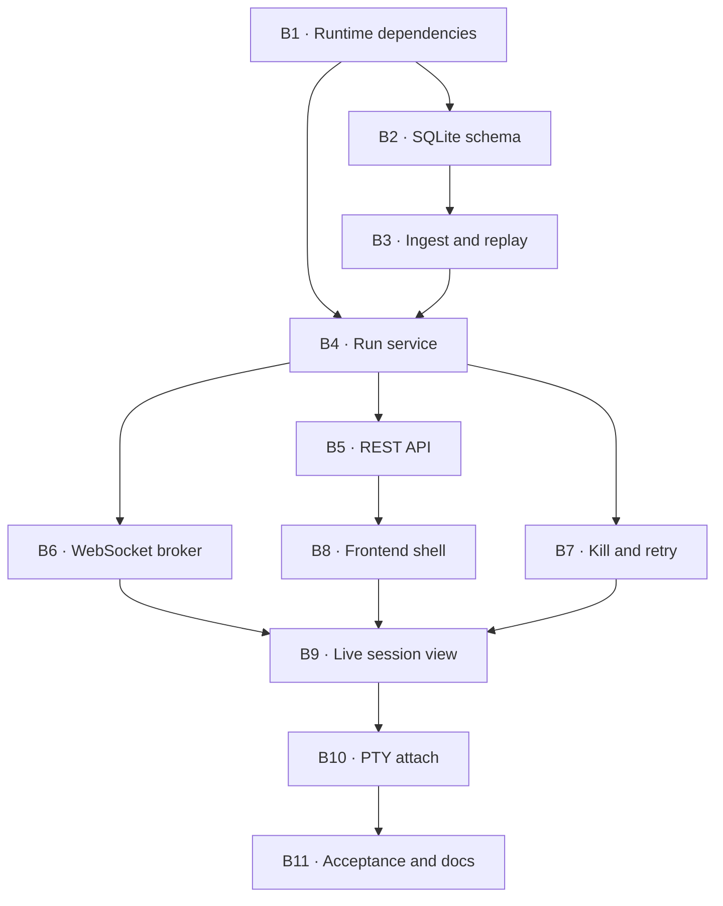

# Phase 1 — Single-node orchestrator

**Goal:** turn the proven one-shot spike into a persistent local application:
one session, one node, one active harness run, live structured events in the
browser, kill/retry, and deterministic replay from NDJSON into SQLite.

No planner and no graph scheduler yet. The single node is deliberately fixed so
this phase can prove lifecycle, persistence, reconnect, and failure semantics
before concurrency multiplies them.

## Activities

### B1 — Runtime dependencies and application entry point ✅

Add FastAPI, Uvicorn, aiosqlite/SQLModel, Alembic, and the CLI package entry
point. `app/main.py` must expose a health endpoint, initialize resources through
FastAPI lifespan, bind to `127.0.0.1`, and contain no orchestration logic.

**Done when:** the server starts, `/health` responds, OpenAPI is generated, and
the existing lint, type, import, and test gates remain green.

**Result:** completed on 2026-08-05. The installed `agenthub serve` command binds
only to `127.0.0.1`; a real Uvicorn process returned `200 OK` from `/health`, and
the OpenAPI contract plus lifespan are covered by tests. FastAPI, Uvicorn,
SQLModel, aiosqlite, Alembic, and settings support are locked in `uv.lock`.

### B2 — SQLite schema and migrations ✅

Create the Phase 1 subset of the data model: session, node, run, and append-only
usage event. Enable WAL and foreign keys on every connection. Store event paths,
status, harness/model, timestamps, token fields, source, price-table version,
and ingest-time estimated equivalent cost.

**Done when:** Alembic builds an empty database and repository tests prove
foreign keys, WAL, append-only usage, and retry as multiple runs for one node.

**Result:** completed on 2026-08-06, 66 new tests. Columns are split into
*authored* (input no log can invent — replay must never delete a `session` or
`node` row) and *derived* (each names the event it comes from). `usage_event`
gains `seq`, unique per run, because two `Usage` events can be identical in
every other field and a double ingest would otherwise double the totals.
Append-only is a `BEFORE UPDATE ... RAISE(ABORT)` trigger, not a convention.
`PRAGMA foreign_keys` is applied per connection via a `connect` listener —
it is off by default and a pooled connection that skips it stops enforcing
every declared FK.

Two things it surfaced that changed the design: replay would have silently
repriced history, and `meta.json` has to carry `session_id`/`node_id` because
`RunStarted` holds the *harness's* session id, not ours. Both are now specified
in `docs/architecture.md` §4.

One known wart: `RunStatus`/`UsageSource` are declared in both
`app/harnesses/events.py` (as `Literal`, for the wire) and `app/models/status.py`
(as `StrEnum`, for the rows), with a drift test pinning them together. Moving
them into `models/` and re-exporting is the clean fix, but it collides with the
`StrEnum` of the same name and forces a choice of representation on the
persistence layer too — worth doing deliberately, not as a drive-by.

### B3 — Ordered ingest and replay ✅

Implement the required write order: NDJSON append → SQLite projection → event
broadcast. `agenthub replay <run_id>` must discard and rebuild only derived rows
from the log, producing the same run projection and usage totals without
mutating the authored session or node.

**Done when:** crash-boundary tests cover death after steps 1 and 2, and replay
is idempotent and byte-for-byte event compatible.

**Result:** completed on 2026-08-06. One write path now enforces NDJSON append
and flush → SQLite projection → broadcast, with tests observing each boundary.
`agenthub replay <run_id>` rebuilds only `run` and `usage_event`, preserves the
authored session/node rows, retains event timestamps and attempt number, refuses
missing pinned price versions, and recovers a torn final line as an interrupted
run while rejecting corruption elsewhere. Interrupted projections retain event
and permission-denial counts, so their replay checks are as strong as completed
runs. Parser trust and sanitized launch metadata live atomically in `meta.json`.

### B4 — Single-run application service ✅

Replace the throwaway driver with an orchestrator service that creates the
session integration worktree and node worktree, selects an adapter through the
registry, streams into B3, checkpoints the node, and merges only a trusted
successful run. One active run per session is sufficient.

**Done when:** a fake adapter drives the complete lifecycle without HTTP, and
the service has no harness-name conditional.

**Result:** completed on 2026-08-06. `SingleRunService` creates the session
integration worktree and its fixed node worktree, resolves adapters only through
the registry contract, applies the mandatory ai-jail launcher, streams every
event through B3, finalizes parser trust, checkpoints the node branch, and
integrates only a changed, trusted success with no permission denials.
`auto_merge=False` leaves the node `awaiting_review`; explicit approval repeats
the safety check before git is touched. A per-session lock plus a persisted-run
check enforce one active attempt. Tests drive the entire path with an arbitrary
fake harness name and real temporary git repositories, including unsafe runs,
manual approval, and concurrent-start refusal. The FastAPI lifespan now owns
database migration, engine disposal, pricing, and this service.

### B5 — REST API ✅

Expose the minimum resource API: create/get/list sessions, get the fixed node,
start a run, inspect run history, and retrieve the final diff. Routes validate
and delegate; all decisions stay in B4.

**Done when:** API tests cover success, invalid transitions, missing resources,
and a reconnect reading persisted state.

**Result:** completed on 2026-08-06. `/api/sessions` now creates, lists, and
reads sessions; nested endpoints expose the fixed node, start and list runs,
apply approval, and return the node's final patch. Routes only validate, map
domain errors to HTTP, and delegate to `SingleRunService`. End-to-end tests use
TestClient, a fake adapter, migrated SQLite, and real git worktrees, then reopen
a fresh application against the same root to prove persisted reconnect. Invalid
state returns 409, missing resources return 404, and invalid bodies return 422.
The node base checkpoint is now an immutable commit, so its diff remains
available after integration merge and restart.

### B6 — WebSocket event broker ✅

One `/ws` connection multiplexes `session:<id>` and `run:<id>` topics. Publish
events only after they are durable in NDJSON and projected in SQLite. Bound each
subscriber queue and make disconnect cleanup deterministic.

**Done when:** ordering tests prove a reconnect can fetch persisted state and
then continue without an event gap or duplicate.

**Result:** completed on 2026-08-06. The application now owns one `/ws` broker
that multiplexes run and session topics and receives the canonical
`AgentEvent` serialization only after B3 has flushed NDJSON and updated SQLite.
Each browser has one bounded outbound queue; overflow removes the connection
and closes it with retryable code 1013 without awaiting or failing ingest.

Every topic carries a broker-stream identifier and monotonic sequence. Clients
retain the last delivered cursor and atomically replay the bounded history on
reconnect, dropping duplicate sequences. A new backend process issues a fresh
stream checkpoint instead of accepting a stale cursor, and an expired history
window is an explicit `history_gap` rather than silent data loss. Tests cover
the real FastAPI WebSocket, dual-topic fan-out, canonical payloads, ordered
reconnect replay, restart reset, expired cursors, service registration before
the first broadcast, and slow-subscriber cleanup. The frontend's single socket
implements the same cursor protocol and passes typecheck, lint, and build.

### B7 — Kill and retry ✅

Kill the process group, persist an interrupted terminal event, keep the failed
node branch for inspection, and create a new `Run` for retry. Never mutate the
old run into a retry.

Codex continuation (`codex exec resume <thread_id> -`) is a separate operation
from retry. Implement continuation only after the lifecycle states can represent
another process for the same logical run without losing event order.

**Done when:** tests cover kill during a tool, retry after failure, and refusal to
merge any interrupted or parser-untrusted run.

**Result:** completed on 2026-08-06. `SingleRunService` now tracks the active
adapter handle for each session, including the start/kill race, and exposes
kill as a normal lifecycle operation. Both process adapters launch an isolated
process group; kill sends TERM to the group, escalates to KILL after the bounded
grace period, and synthesizes a durable `RunFinished(status="interrupted")`.
The partial node work is checkpointed for inspection, the node becomes failed,
and neither automatic nor explicit approval can merge it.

Retry is allowed only after a terminal failed or safety-blocked attempt. It
reuses the node brief and worktree but inserts a new `Run` with the next attempt
number, a separate NDJSON/meta directory, and independent token/cost rows; the
old row, log, and failed checkpoint remain unchanged. REST now exposes
`POST /api/sessions/{id}/kill` and `/retry`, with regenerated OpenAPI and
TypeScript contracts. Tests kill both real subprocess stand-ins plus a fake run
while a tool is active, prove interrupted events survive in NDJSON, prove the
integration branch stays untouched, and prove retry retains attempt 1 while
attempt 2 succeeds.

### B8 — Frontend shell and generated types ✅

Create Vite + React + TypeScript strict, Tailwind v4, shadcn/Base UI foundations,
TanStack Query, Zustand, and one WebSocket client. Generate REST types from
OpenAPI; generate `AgentEvent` TypeScript from the canonical schema and commit
both outputs.

**Done when:** `pnpm typecheck`, Biome, and the generated-type drift check pass.

**Result:** completed on 2026-08-06. The scaffold landed first — Vite + React
19 + TS strict, Tailwind v4 on the §2 tokens, Biome, TanStack Query, Zustand,
router, and one WebSocket client with topic multiplexing and jittered reconnect.
`typecheck`, `lint` and `build` pass and the shell renders.

With B5's contract in place, `backend/scripts/export_schemas.py` now exports
deterministic OpenAPI and `AgentEvent` JSON Schema documents, and `pnpm gen:api`
commits their TypeScript mirrors. Both generators have offline `--check` modes.
TypeScript is pinned to the generator's declared `^5.x` peer range; the earlier
7.0 scaffold crashed inside `openapi-typescript` before reading the document.

Corrections to `docs/design-system.md` §12 came out of this and are recorded
there; the one with teeth is that `tailwind-merge` silently drops a §3 text size
when it meets a §2 text colour, because Tailwind v4 puts both in the `text-*`
namespace. Every shadcn component funnels through `cn`, so it mis-sizes text
application-wide with no type error.

### B9 — Live session view ✅

Implement the single-session route with node status, structured event feed,
token totals, equivalent cost, start/kill/retry controls, and final diff. The UI
must render `source="reconstructed"` usage distinctly and surface parser drift
as an unsafe run.

**Done when:** refresh/reconnect preserves state and a fake streamed run drives
the view through pending → running → done/failed/interrupted.

**Result:** completed on 2026-08-06. `/sessions/:id` is now the operational
single-node view: generated REST contracts hydrate session/node/run state,
Zustand holds the live structured feed, and one session-topic subscription
reconciles WebSocket facts with persisted NDJSON after refresh without
duplicating the overlap. The backend exposes a run summary for the four token
fields, ingest-time estimated equivalent cost, completeness, and parser trust;
the event history endpoint returns the canonical `AgentEvent` serialization
without introducing an OpenAPI mirror of that union.

The dense two-panel UI renders status, harness/model/attempt metadata, event
types, reconstructed usage labels, run history, token totals, estimated
equivalent cost, and the final diff. Controls follow persisted node state for
start, process-group kill, retry, and approval. Terminal untrusted runs carry a
written parser-drift warning and cannot be mistaken for safe work. The sessions
index links persisted sessions into the live route.

Vitest and Testing Library now cover REST/WS overlap, canonical payload
validation, true duplicate preservation, refresh of an interrupted attempt,
parser-drift presentation, and a fake streamed route transition from ready to
running to done. Frontend test, typecheck, lint, and production build pass.

### B10 — PTY attach ✅

Validate the Channel B design against the active Codex harness before building
the terminal. `codex exec --json` is non-interactive, so do not assume a second
PTY process observes the same session. Evaluate the documented app-server/remote
surface and record whether attach is observational, interactive, or must be
deferred. Only then bridge bounded raw bytes to xterm.js.

**Done when:** the real CLI proves the selected topology and a slow WebSocket
cannot backpressure the PTY reader.

**Result:** completed on 2026-08-06 as a validated deferment for the active
Codex adapter. Codex CLI 0.146.0 proved that app-server is genuinely
interactive: two initialized WebSocket clients resumed one persisted thread,
received the same live `turn/*`, `item/*`, and usage notifications, and saw the
same final response. A real `codex resume --remote` TUI then opened that thread
inside a PTY and rendered its shared history.

The same experiment proved why this cannot be bolted onto the existing adapter.
`codex exec --json` is a stable non-interactive process with no `--remote`
surface. App-server can resume its persisted rollout only as a separate runtime;
that is continuation, not observation of the active turn, and edits made there
would escape the attempt's NDJSON/checkpoint/merge lifecycle. App-server's
WebSocket transport is also explicitly documented as experimental and
unsupported. Phase 1 therefore keeps the stable structured adapter and does
not render a misleading terminal. No PTY reader or raw-byte WebSocket path is
started, so a slow client has nothing to backpressure. The bounded
drop-from-the-middle bridge remains mandatory when app-server becomes the
primary ai-jail-contained Codex runtime. The evidence and topology boundary are
recorded in `docs/architecture.md` §5.

### B11 — Acceptance and operating documentation ✅

Run one real Codex session through HTTP and WebSocket, disconnect/reconnect,
kill or retry a second run, replay both from NDJSON, and verify the database and
UI totals. Add install/run instructions only after this succeeds.

**Done when:** the acceptance record is committed and the roadmap marks Phase 1
complete.

**Result:** completed on 2026-08-07. A real Codex 0.146.0 session was created
through HTTP and observed through the production WebSocket. The client
disconnected at session-topic sequence 5, resumed on the same stream, and
received sequence 6 without a gap before killing attempt 1 during a tool. Retry
created attempt 2, completed successfully in the same node worktree, and
stopped at `awaiting_review` with the exact accepted file in its checkpoint.

Both runs were rebuilt independently from NDJSON. Attempt 1 remained
interrupted with 6 events and no invented usage; attempt 2 remained successful
with 12 events and four-field totals of 9,060 input + 485 output + 62,208 cache
read + 0 cache write. SQLite, REST summaries, persisted events, and the UI
component agreed on 71,753 total tokens and $0.045477 estimated equivalent
cost. Install, run, session creation, replay, data-location, and verification
instructions now live in `README.md`; the complete evidence is in
`docs/acceptance-phase-1.md`.

## Explicitly out of scope

Planner prompts, DAG validation, multiple nodes, concurrency, dashboards,
system metrics, code search, OpenCode, and production packaging.
