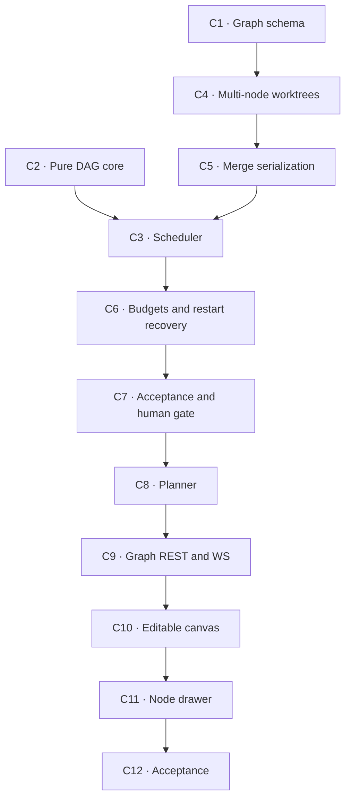

# Phase 2 — The graph

**Goal:** a described objective becomes a validated DAG of activities, a human
edits and approves it, and a concurrent scheduler executes it — each node in its
own worktree, each merging into the session integration branch.

This is the heart of the product (`design.md` §10). Phases 0 and 1 proved one
node can run, be observed, and be replayed. Phase 2 is where the graph stops
being a picture next to a task list and becomes the unit of execution.

## What is actually risky here

Not the planner. Structured output against a JSON Schema is well-understood, and
`design.md` §8 already specifies the node schema and the "hand a cycle back to
the planner" loop.

The risk is that **`SingleRunService` is built on "one active run per session"**,
and generalizing it touches everything at once: the ingest path assumes one
`meta.json` being finalized, the broker assumes one run topic per session, kill
and retry assume one `_ActiveRun`, and the worktree base stops being "the
integration branch" and becomes "the merge of the parents". Concurrency
multiplies every failure mode Phase 1 handled once.

Second risk, close behind: **parallel merges into one integration branch**.
Phase 1 merged one node with nothing else in flight. With three nodes finishing
within seconds of each other, the integration worktree is a single shared
resource, and `docs/architecture.md` §4's write ordering says nothing about it.

So the ordering below front-loads both, and leaves the planner — the visible,
demo-friendly part — until the machinery underneath it is real.

Two edges of the graph below changed once the work started. C2 turned out not
to need C1: the pure core takes plain ids and statuses, so making it depend on
the tables would only have coupled them. And C5 turned out to belong with C4
rather than after C3 — they are the same file and the same problem, worktrees
under concurrency, and neither needs a scheduler to be provable.

## Activities

---

### C1 — Graph schema and migration ✅

A `Session` today owns exactly one `Node`. It must own many, with edges.

Add `depends_on`, `touches`, `acceptance_criteria`, and per-node `harness` and
`model` (`design.md` §8's planner schema). Add `auto_merge` at the session level
if B2 did not already land it.

Edges are their own table, not a JSON column on `node`: the scheduler queries
them, and a JSON blob makes "which nodes are ready" a full scan plus a parse.

Keep B2's discipline — authored versus derived columns, and every derived one
still rebuildable from `events.ndjson` (invariant 4). `depends_on` is authored:
no log can invent it.

**Done when:** Alembic migrates an existing Phase 1 database forward without
losing its single node, and repository tests cover a multi-node session with
edges, including a self-edge and a duplicate edge being rejected at the
database level.

**Result:** completed on 2026-08-07, 29 tests. `node_dependency` with a
composite primary key; three of the four graph constraints are enforced by
SQLite rather than Python, and orphan `depends_on` falls out of the foreign
keys — which means it only ever exists in the planner's JSON. `load_graph` is
three statements regardless of node count.

Only `touches` and `estimated_effort` were genuinely new; `acceptance_criteria`,
`harness`, `model` and `auto_merge` already existed. Corrections to `design.md`
§5 and §8 are recorded there.

**Left open, and it must be closed before C8:** `acceptance_criteria` is an
array in §8's schema and a single `TEXT` column in the table. Changing it
touches `api/schemas.py` and the generated frontend types, so C1 correctly did
not do it as a drive-by — but a planner writing to a string column joins the
criteria with newlines, and the per-criterion results §8's `awaiting_review`
panel promises are then unrecoverable.

Also worth writing down because C9/C10 will rely on it: adding or removing an
edge stamps the **dependent** node's `updated_ms`; the dependency's is
untouched. Without that rule a removed edge deletes the only row carrying a
timestamp and the graph's shape has no mtime at all.

---

### C2 — Pure DAG core ✅

`orchestrator/graph.py`, extending what is there rather than replacing it.

Cycle detection, orphan `depends_on` detection, topological sort, ready-set
computation, and deadlock detection.

**Pure. No I/O, no async, no database** (`docs/architecture.md` §3). This is the
module that should have exhaustive tests, because it is the only part of the
scheduler that can be tested without processes, worktrees, or time.

**Done when:** property-style tests cover cycles of length 1, 2 and n, diamonds,
disconnected components, and the deadlock case; and every function is total —
an invalid graph returns a typed error, never raises.

**Result:** completed on 2026-08-07, 123 tests. `build_dag` returns
`Dag | InvalidDag`; `evaluate_graph` is the single call the scheduler makes per
tick, returning one consistent snapshot.

Four things this activity settled that the documents left open, all now
reflected in `design.md` §9:

- **Ready takes a status *map*, not a set of completed ids.** A set cannot
  express that `awaiting_review` is neither complete nor blocking-forever, nor
  tell `failed`/`blocked` apart from `pending` for propagation. The sketch in
  `docs/architecture.md` §3 has the same problem.
- **Four outcomes, not one `break`**: `active`, `waiting_on_human`, `complete`,
  `deadlocked`. Given a valid DAG, `deadlocked` is only reachable when a
  transition was not persisted — it detects a scheduler bug.
- **A `skipped` node satisfies its dependents**, and a startable node is
  `pending` *or* `ready`.
- **A cycle is reported as a shortest path** through the strongly connected
  component's lowest node id, not as the whole SCC — an eight-node SCC
  containing a two-node loop tells C8's correction loop almost nothing about
  which edge to delete. All defect categories are reported in one pass, because
  C8 bounds that loop to three attempts and must not spend one per typo.

`blocked` nodes carry the *named* ancestors responsible, propagated through
intermediate pending nodes, so a diamond's join names the branch that failed
rather than its immediate parent. `design.md` §8's drawer shows a reason, and
"failed dependency" without the dependency is not a reason.

---

### C3 — Concurrent scheduler ✅

`orchestrator/scheduler.py`. The topological loop from `design.md` §9 — and
nothing more. **Do not build a generic workflow engine.**

`max_concurrency` configurable, **default 2**. Each agent is a heavy process
holding a rate limit; ten in parallel locks the machine and exhausts the quota.

State is persisted on **every** transition, not at the end. The scheduler must be
able to die at any point and have the database describe reality.

This is where `SingleRunService` generalizes. Decide deliberately whether it
becomes `GraphService` or grows a scheduler alongside it — but the harness-name
neutrality (invariant 1) and the NDJSON→SQLite→broadcast ordering
(`docs/architecture.md` §4) are not negotiable, and both currently assume one
run at a time.

**Done when:** a fake adapter drives a diamond graph to completion with
`max_concurrency=2`, provably never exceeding two concurrent runs; and a node
failure leaves its dependents `blocked` rather than `pending` forever.

**Result:** completed on 2026-08-07, 28 tests. `SingleRunService` became
`NodeRunService` — the same class re-keyed from session to **node**, because a
node is what genuinely admits one run at a time (one worktree, one live
process) while a session is explicitly meant to have several. `GraphScheduler`
is separate, coupled through a three-method `NodeLifecycle` protocol that is
also the complete set of transitions the scheduler may cause.

**Two claims in "what is actually risky", above, were wrong.** The ingest path
does *not* assume one `meta.json` — it derives the path from `meta.run_id` and
holds no module state. The broker does *not* assume one run topic per session —
`register_run` fans out to both topics. Neither needed changing.

The assumption that did bite was invisible from the outside: the session-status
projection was written through the run's long-lived `AsyncSession`, and
`expire_on_commit=False` plus SQLModel's identity map means such a session never
sees a sibling row another connection changed. With two nodes in flight it
folded over stale siblings. It now runs on a fresh connection under a
per-session mutex.

`asyncio.TaskGroup` turned out to be the wrong tool despite
`docs/conventions.md` §2 reaching for it: it cancels every sibling when one
child fails — the opposite of "agent failure is data" — and re-raises as an
`ExceptionGroup`, which turned an `InvalidGraphError` into a 500 at the
transport.

**A `skipped` parent has no branch.** It never ran, so materializing a child off
it dies with *invalid reference*. Parents are filtered to those with a persisted
branch; a node whose parents were all skipped is created off `integration`.
Neither `design.md` §9 nor §2.2 mentions this.

**The concurrency-bound test as first written could not fail** — a diamond
offers at most two parallel nodes, so an unbounded scheduler still peaks at two.
It now gives four independent nodes two slots and parks every arrival until the
census is sampled; removing the bound turns it red.

**Left open for C9:** the REST routes are still session-addressed and now return
**409** on a multi-node session, so graph sessions have no HTTP surface yet.
Guessing which of four nodes `/diff` meant would be worse.

---

### C4 — Multi-node worktree materialization ✅

`design.md` §2.2 and the Phase 0 A7 findings: `git worktree add` takes **one**
commit-ish, so a multi-parent node is created off the first parent with the
remaining parents merged in, and folding stops at the first conflict — the node
comes back `blocked` before any agent launches.

`worktree.py` already implements this (`create_node(parents=...)`). C4 is about
driving it from the graph and proving it under concurrency, not rewriting it.

**Done when:** a diamond graph produces a final node whose worktree contains the
edits of both parents, and a deliberate parent conflict blocks the child without
launching an agent.

---

### C5 — Merge serialization ✅

Three nodes finishing at once contend for one integration worktree. Git will not
protect you: a second `git merge` during an unfinished one fails in a way that
looks like a conflict.

Serialize integration merges explicitly. The lock is on the *integration
worktree*, not on the session — node worktrees stay parallel, only the merge is
sequential, and it is fast.

A conflicted merge is aborted, not left in place (`design.md` §2.2) — leaving the
shared worktree in `MERGING` blocks every other node behind one human, which is
exactly the failure this activity exists to prevent.

**Done when:** a test races N nodes into integration and every one of them lands
or blocks, with no interleaved merge state and no lost commit.

**Result:** C4 and C5 completed together on 2026-08-07, 18 tests. Two mutexes,
both keyed by resolved path rather than held on `SessionWorkspace` — that is a
frozen value callers rebuild from database columns on every call, so a
per-instance lock would be new and uncontended each time and would serialize
nothing.

The merge race is worse than predicted. Git's locking is per file and released
*between the commands of a merge sequence*, so a second merge started during an
unfinished one exits 128 three different ways, or exits **1** with "Unable to
write index" — the same code a real conflict uses. And whichever loser reaches
`git merge --abort` first aborts the *winner's* merge. Measured with five nodes:
one commit landed and four raised; in one run nothing landed and the shared
worktree was left dirty.

**Concurrent `git worktree add` is also unsafe**, which C4 did not anticipate.
It writes `.git/worktrees/<id>/commondir` in two steps and a concurrent add
enumerates the same directory, dying on a short read. Clean at 2–8 way, 3/60 at
16-way. Rare at `max_concurrency` 2–3 and a hard exception at exactly the wrong
moment, so `add`/`remove`/`prune` are serialized per *repository* — not per
session, because `.git/worktrees/` is shared by every session on it.
`worktree list` tolerates a half-written entry and stays unlocked, which also
keeps `remove_node` off a non-reentrant lock.

Cross-process guarding is out of scope, argued rather than ignored: git would
not provide it either, and the SQLite projection and event log already assume a
single writer, so a git lock alone would advertise a guarantee the rest of the
process does not keep.

---

### C6 — Budgets, timeouts and restart recovery ✅

Per-node **token budget and wall-clock timeout**, with kill (`design.md` §9 and
§12's runaway-agent risk). An agent in a loop burns hundreds of thousands of
tokens silently; the cutoff marks the node `failed`.

Phase 0 A3 found that a budget-exhausted Claude Code turn reports
`result.usage` as all zeros, so the budget check must read the reconstructed
`Usage` — the one B3 marks `source="reconstructed"` — not the raw one.

Restart recovery: on startup, every `run` row still `RUNNING` is an orphan. B2's
`RunState` docstring already says the scheduler resolves it to `INTERRUPTED`
rather than inventing a sixth state. Either re-find the process by PID or mark
it orphaned; do not leave the row lying.

**Done when:** a token budget kills a running node mid-stream and the node is
`failed` with its partial usage recorded; and a scheduler restarted with a
`RUNNING` row resolves it without human intervention.

**Result:** completed on 2026-08-07, 16 tests. The budget counts all four fields
from the `Usage` events themselves, `reported` and `reconstructed` alike —
A3 found that a budget-exhausted Claude Code turn reports `result.usage` as all
zeros, so a budget trusting the harness's own total reads zero in exactly the
runaway case it exists to stop.

The wall clock is a background task rather than `asyncio.timeout` around the
event loop: a timeout raises and cancels, and cancelling would skip the
checkpoint commit and leave the partial work uncommitted. Being cut off is an
ordinary terminal outcome, not an error.

**Recovery never adopts a leftover run, and the reason is stronger than pid
reuse: adoption is not implementable.** The adapter reads events off pipes that
died with the parent that opened them, so a re-found process can emit no further
`AgentEvent` and its run could never honestly finish. A gone process leaves the
node `failed` and retryable; one that survived SIGTERM leaves it `blocked`,
because the scheduler drives past `failed` on its own and a second agent in a
worktree the first is still writing to corrupts the diff invariant 2 protects.

Also bounded the broker, which C3 reported: `_history`, `_sequences` and
`_run_sessions` each grew one entry per run forever. The trap in fixing it is
that an eviction without a record is indistinguishable from a topic that never
published, so a stale cursor would be told it is current and silently skip the
difference. Every drop now raises `ReplayGapError` instead.

---

### C7 — Acceptance checks and the human gate ✅

**A gap in this plan, found while building C1:** `design.md` §9's scheduler
sketch calls `check_acceptance(node)` and §8's `awaiting_review` panel shows
"acceptance-criteria **results**", per criterion — but no activity below owned
running those checks. It belongs here, ahead of the gate, because the gate is
what consumes the results.

So C7 runs each criterion and records a per-criterion outcome, then gates on
it. (The `acceptance_criteria` column was closed separately, by revision
`dab2c49d6ccb`, before this activity started.)

`auto_merge` off means a finished node stops at `awaiting_review` (invariant 6:
the planner's graph is a proposal, and nothing runs — or merges — before
approval).

Approve merges; reject retries **with feedback**, which means the rejection text
reaches the next run's prompt. B7's immutable-attempt rule holds: a retry is a
new `Run`, never a mutated one.

**Done when:** each acceptance criterion produces its own pass/fail; with
`auto_merge` off, a completed node blocks its dependents until approved; and a
rejection's feedback reaches the retry's prompt.

**Result:** completed on 2026-08-07, 25 tests. Two tables keyed
`(node_id, attempt)`, hanging off `node` and off nothing else.

That key is the whole design. Replay calls `delete_run()` and rebuilds, so a
foreign key onto `run` would take a human's verdict out with `ON DELETE
CASCADE` — invariant 4 lets replay discard *derived* rows, and a judgement is
authored input. Per attempt rather than per node because a retry is judged
against a different diff.

Outcomes are three states, not two-plus-absence: an absent row cannot
distinguish "not looked at yet" from "the criterion did not exist at run time"
from "nobody was ever going to look". Writing the snapshot for every run makes
§9's stated limitation visible in the data — a merged commit with `unevaluated`
rows and no review row *is* an unattended graph merging on the harness's own
verdict.

Rejection feedback accumulates across attempts and never touches
`node.prompt`. An agent shown only the newest complaint fixes it by undoing the
fix for the oldest.

**This activity's done-when was half-impossible as written.** It asked for the
feedback in the retry's `meta.json` "argv or prompt" — but `argv` deliberately
never carries the prompt, because argv is visible in `ps`
(`docs/conventions.md` §6), so for any real harness `meta.json` cannot hold it.
The assertion is on the `RunSpec` the adapter was handed. If reproducibility
wants the composed prompt durable, that is a new `meta.json` field and a
`storage/` change.

**Left for C9 to decide, not a bug:** `reject_node` runs the retry
synchronously, so an HTTP reject would hold the request for a whole agent run.
The persisted state is already correct if the process dies mid-way — the
verdict is written before the transition to `ready` — so C9 can schedule it
instead.

---

### C8 — Planner ✅

`orchestrator/planner.py`. Objective → DAG via **structured output against a
JSON Schema**, never markdown parsing. The node schema is specified in
`design.md` §8.

**Prerequisite settled ahead of time:** the planner calls the Anthropic API
directly rather than reusing an authenticated `claude -p`, because the CLI
structures the event envelope and not the assistant's content — there is no CLI
equivalent of `output_config.format`, so a harness-routed planner is
prompt-and-parse. That adds the `anthropic` SDK as a dependency and makes the
planner the only component with **real** per-token billing (invariant 7's
"estimated equivalent" framing does not apply to it). Reasoning in `design.md`
§8.

Validate before rendering. On a cycle or an orphan `depends_on`, **hand the
error back to the planner to fix** — LLMs get this wrong regularly, and breaking
the UI over it is a choice, not a necessity. Bound the correction loop; a
planner that cannot produce a valid DAG in three attempts is a failure to report,
not a loop to run forever.

The proposal is persisted as a graph in `pending` state. Invariant 6: nothing
executes before human approval while `auto_merge` is off.

**Done when:** a recorded planner response builds a valid graph; an injected
cyclic response triggers exactly one correction round-trip and then succeeds; and
an incorrigible planner fails with a message naming the cycle.

**Result:** completed on 2026-08-07, 36 tests. `messages.parse()` against a
Pydantic model, slugs mapped before persistence, DAG validated **on slugs**, and
a three-attempt correction loop.

Validating on slugs rather than after the write is load-bearing, and disabling
it proved why: the same cycle still surfaces — from `create_graph`, two attempts
too late, and named in ULIDs the model cannot edit.

**Planner tokens are returned and logged, not written to `usage_event`** — and
not by preference. `run_id`, `session_id` and `harness` are all `NOT NULL`, so
recording a planner call means fabricating a run and a node that no
`events.ndjson` can rebuild, and writing `"planner"` into `harness` puts real
spend into the per-harness view as a harness that does not exist, mixed
unlabelled with invariant 7's estimated equivalent. Making it recordable needs
four changes (nullable `run_id`, an `origin` with a billing discriminator,
nullable `session_id`, and an event log for the call) — a migration, and Phase
3's problem when the dashboard actually reads it.

Three things the documents got wrong:

- **`messages.parse()` can raise before `stop_reason` is readable.** "Check
  `stop_reason` first" is necessary but not sufficient: the SDK validates every
  text block after parsing, so a refusal or truncation carrying *prose* raises
  out of the call. A refusal with empty content — the common shape — does reach
  the check. Both paths are handled.
- **§8's schema and the `node` table disagree on one more field than C1
  recorded.** §8 has `title` *and* `description`; the table has `name` (taken by
  the slug) and `prompt`. The title is folded into the prompt as a heading —
  recoverable, but a fold, not a column. If C10's canvas wants a display title,
  that is a migration and should be decided before C10.
- **§8 anticipates one non-success outcome; there are five** — refusal,
  truncation, unparseable content, an empty plan, and an unreachable API. Each
  needs a different message and none is an exception.

---

---

### C9 — Graph REST and WebSocket ✅

Create a graph from a planner proposal, edit nodes and edges before approval,
approve, run, and per-node operations. Routes validate and delegate; every
decision stays in the orchestrator (`docs/architecture.md` §1 rule 3).

The WebSocket gains a graph-level topic carrying node status transitions. Reuse
B6's bounded, cursor-replay broker — do not write a second one.

**Done when:** API tests cover editing a graph before approval, refusing to edit
one after it has started, and a reconnect replaying node transitions without a
gap.

**First half:** completed on 2026-08-07, 19 tests. Node-addressed routes
nest under the session — `/sessions/{id}/nodes/{node_id}/...` — so containment
is checkable: addressing another session's node returns 404 rather than
silently operating on its worktree. The session-addressed routes stay; their
409 on a multi-node session was never the defect, the absence of an alternative
was. The graph topic goes through the broker's retention path, so an evicted
cursor still raises instead of silently resuming.

**Follow-up result:** the missing orchestration seam is now complete. A graph
read returns nodes and edges; pending proposals support complete node edits,
node removal, and edge addition/removal; every added edge is validated through
the pure DAG core before persistence. Approving promotes only roots to
`ready`, which records the plan gate without a migration, and every later edit
is refused because the graph is no longer an all-`pending` proposal.

`GraphScheduler` is process-owned in `app.state`, deduplicates background runs
per session, and cancels them before database shutdown. The REST surface now
has graph approve/run plus per-node diff, attempts, summaries, canonical
events, and standalone criterion resolution. `reject_node` was split at the
durable boundary: it records the verdict, transitions to `ready`, and returns
202; the scheduler creates the new immutable attempt afterward with all prior
feedback composed into its prompt.

Node transitions now leave one service hook after the node and session
projections are committed. This makes scheduler-caused `ready`, `running`,
review, failure, and terminal states visible on the bounded graph topic; routes
no longer publish a guessed final state. A WebSocket test proves the scheduler's
`running` and terminal frames arrive in sequence. The complete suite is 677
passed, 2 optional harness tests skipped; Ruff, mypy, import contracts,
generated schemas, frontend typecheck, lint, tests, and build are green.

**The topic vocabulary changed.** `docs/architecture.md` §6 now includes
`graph:<session_id>`. The frontend's `src/ws/protocol.ts` union is hand-written,
not generated; decoding `node_status` frames remains part of C10, while the
expanded REST schema is already generated for it.

---

---

### C10 — Editable canvas ✅

`@xyflow/react` + `elkjs` for layout, per `design.md` §6 and §8. The graph is an
**editable proposal**: rename, remove, add an edge, and assign harness and model
per node.

Node visual encoding comes from `docs/design-system.md` §5 — colour by state
always paired with an icon, never colour alone. `src/lib/node-state.ts` already
holds that mapping from B8; consume it rather than redefining it.

**Done when:** a proposal renders, survives edit and reload, and the approve
action is disabled while the client-side graph is invalid.

**Result:** completed on 2026-08-07. The session route now renders multi-node
graphs with `@xyflow/react`; ELK owns the layered layout and remains a frontend
detail, so no coordinates entered the REST model. Both the canvas and ELK are
loaded on demand: the normal application bundle remains 468 KB while the large
layout engine is fetched only when a graph is opened.

Pending proposals support complete node replacement (including name, harness,
and model), node removal, and dependency creation/removal through C9's REST
surface. Successful mutations replace TanStack Query's persisted graph; a
reload therefore reads the edit back from SQLite rather than from UI state.
The editor preserves authored fields it does not expose yet — prompt,
acceptance criteria, touches, and estimated effort — instead of erasing them
during a rename.

The client validates the whole draft for self-dependencies, duplicate edges,
orphans, and cycles. An invalid connection stays visibly dashed and red until
removed, is never sent to the backend, and disables graph approval. Server-side
DAG validation remains authoritative; this client pass exists to make the
proposal repairable before the approval request.

Node state rendering consumes `src/lib/node-state.ts` for colour, icon, and
label. The C9 `graph:<session_id>` topic is now decoded as orchestration state
distinct from `AgentEvent`; a transition invalidates the persisted graph query.
The frontend suite is 15 tests across 6 files, including edit/reload, invalid
approval, route integration, and WebSocket decoding; typecheck, lint, and the
production build are green.

---

### C11 — Node drawer

The per-state panel from `design.md` §8's table: edit when `pending`/`ready`,
live stream and message input when `running`, diff and approve/reject when
`awaiting_review`, reason when `blocked`, transcript and re-run when
`done`/`failed`.

Most of this exists in B9's single-session view. C11 is largely about making it
addressable per node rather than per session.

**Done when:** clicking any node in a running graph opens its live feed, and the
`awaiting_review` state offers a diff and both actions.

---

### C12 — Acceptance

One real multi-node graph, planned from an objective, edited by hand, approved,
executed with concurrency against a real repository, with at least one
deliberate conflict and one approval gate. Replay every run from NDJSON and
verify the database, REST and UI agree on the totals.

**Done when:** the acceptance record is committed and the roadmap marks Phase 2
complete.

## Explicitly out of scope

Dashboards and system metrics (Phase 3), code search (Phase 4), OpenCode,
multi-repo, remote execution, and the resolver agent for conflicted merges — a
conflict blocks and waits for a human in this phase.
