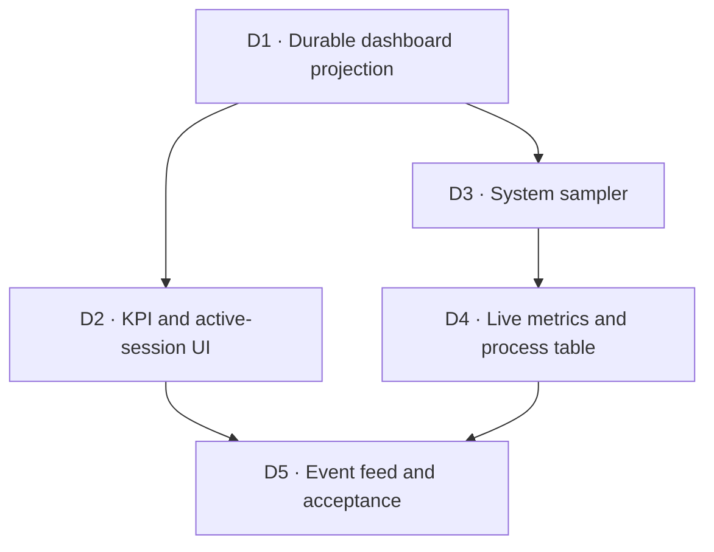

# Phase 3 — Dashboards

**Goal:** the dashboard answers what is active, how much model work it has
consumed, whether runs are completing, and whether the local machine can sustain
the current workload — without turning 1-second telemetry into permanent
database noise.

Phase 2 now provides real concurrent run data and accepted four-field totals.
This phase is a read and observation vertical: it must not acquire authority to
transition a graph, reprice historical usage, or inspect harness-specific event
shapes.

## Activities

### D1 — Durable dashboard projection ✅

Add one read-only aggregate over the SQLite projection and expose it through
`GET /api/dashboard?period=today|7d|30d`.

The response carries all four token fields, stored ingest-time cost and a
completeness flag, breakdowns by harness and model, current active/running/
blocked counts, completion rate, and active session rows with progress,
harnesses, elapsed time, and accumulated usage. Aggregation belongs in SQL;
loading every `usage_event` into Python would make dashboard latency grow with
the entire history.

**Done when:** priced and unpriced usage group correctly without turning unknown
cost into zero, active sessions exclude completed history, and generated
frontend types cover the route.

**Result:** completed on 2026-08-08. `metrics/dashboard.py` is an isolated,
read-only vertical over `Database`; it imports neither the orchestrator nor any
harness. The period total and both breakdowns are SQL `SUM()` queries over the
four token fields and already-pinned `cost_usd`. A mixed priced/unpriced result
returns the known partial sum with `cost_complete=false`; an empty result keeps
cost `null`. Active-session usage is all-time while the KPI aggregate follows
the selected period. Four focused tests cover grouping, UTC/rolling boundaries,
progress, empty semantics, and transport validation.

### D2 — KPI and active-session UI ✅

Replace the dashboard placeholder with the period selector, KPI strip, token
breakdowns, and active session list from `design.md` §8. Every active row deep
links to `/sessions/:id` and shows completed/total nodes, harnesses, four-field
usage, elapsed time, and blocked state.

Tremor's current supported line is **Tremor Raw**, copied and adapted into the
application rather than installed as a component package. The legacy
`@tremor/react` instructions target Tailwind 3, while this repository uses
Tailwind 4; the official Raw docs target Tailwind 4 but still mark the Vite guide
as pending. D2 therefore adapts only the chart primitive it needs, removes Raw's
loose `any` types, and maps every colour to `tokens.css`.

**Done when:** changing period refetches the snapshot, empty/partial-cost states
are honest, and tests prove an active row navigates to its session.

**Result:** completed on 2026-08-08. `/dashboard` now has the three-period
selector, five KPI cards, harness/model token breakdowns, and the active-session
list with progress, elapsed time, harnesses, tokens, blocked badge, and deep
link. The exact “estimated equivalent” label remains visible; mixed pricing is
marked partial, while an empty period renders unknown cost as an em dash rather
than `$0`.

The fixed-order token mix is a small accessible proportional bar plus numeric
legend, using four semantic chart tokens. Tremor Raw's full BarChart would add
Recharts for axes and tooltips this view does not have, and its published source
explicitly suppresses `no-explicit-any`, conflicting with this repository's
strict TypeScript rule. The native microbar is the documented narrow exception;
future time-series charts still use an audited Tremor Raw adaptation. Three
route tests cover real-shaped four-field data, partial and empty cost, period
refetch, and session navigation.

### D3 — System sampler ✅

Use `psutil` for total/per-core CPU, RAM, swap and worktree-disk usage. Calls are
synchronous, so sampling runs through `asyncio.to_thread` (invariant 5). Keep
roughly 300 1-second samples in a bounded in-memory ring; the sampler is owned
and cancelled by the application lifespan.

Also sample each active agent process tree by persisted PID: node id, harness,
RSS, CPU and uptime. A process disappearing between enumeration and reading is
normal data, not a failed dashboard request.

**Done when:** deterministic fake-psutil tests cover process disappearance,
recursive child totals, ring eviction, and cancellation without blocking the
event loop.

**Result:** completed on 2026-08-08. The lifespan-owned `SystemSampler` reads
persisted running PIDs, then moves every synchronous psutil call into
`asyncio.to_thread`. Each immutable snapshot carries total/per-core CPU, RAM,
swap, disk, and a process table whose RSS/CPU sum the root plus recursive live
children. Processes disappearing between enumeration and detail reads are
omitted without losing the host snapshot.

The one-second history is a `deque(maxlen=300)` and therefore cannot grow. The
sampler is idempotently started, explicitly cancelled before database disposal,
and logs a transient sampling failure instead of silently killing its background
task. `psutil` is the runtime dependency required by `design.md` §8;
`types-psutil` keeps the isolated vertical under mypy strict. Tests prove tree
totals, disappearance, persisted PID discovery, worker-thread execution, ring
eviction, duplicate-start refusal, and clean cancellation.

### D4 — Live metrics and process table ✅

Publish sampler frames over the existing multiplexed WebSocket `metrics` topic,
hydrate a Zustand store from the latest snapshot, and render system gauges plus
the agent process table. Reconnect gets a current snapshot; it does not replay
five minutes of 1-second samples through the broker.

**Done when:** one browser connection receives bounded live history and a fake
process tree updates CPU/RAM/disk gauges without polling REST.

**Result:** completed on 2026-08-08. Every completed sampler pass publishes a
generated-schema `SystemSnapshotResponse` payload through the singleton broker's
reserved `metrics` topic. Metrics deliberately bypass durable event history and
retain exactly one current snapshot in the broker: a new or reconnected
subscriber hydrates immediately, while old one-second samples never enter the
cursor replay window. The browser keeps its own 300-sample Zustand ring and
deduplicates the current snapshot by timestamp.

The dashboard subscribes through the application's existing multiplexed
WebSocket and renders live CPU, memory, swap, worktree-disk gauges plus the
persisted node/harness process-tree table with PID, descendant count, CPU, RSS,
and uptime. Runtime protocol validation rejects incomplete metrics frames before
they can reach the store. Broker, protocol, shared-client, bounded-store, and
route tests cover current-snapshot reconnect semantics, duplicate cursor
suppression, ring eviction, and a fake process tree updating the UI without REST
polling.

### D5 — Event feed, minute aggregates, and acceptance

Persist only 1-minute system aggregates, never raw 1-second points. Add the last
N meaningful graph transitions to the dashboard, each deep-linked to its
session/node, and exercise the complete dashboard against real Phase 2 history
and a live short run.

**Done when:** reconnect and process restart preserve minute history, raw sample
count stays bounded, and the committed acceptance record verifies
SQLite/REST/WebSocket/UI agreement.

## Explicitly out of scope

Historical session browsing beyond the active list, billing the subscription as
spend, planner-cost accounting migrations, alert delivery, remote hosts, and
Phase 4 code search.
