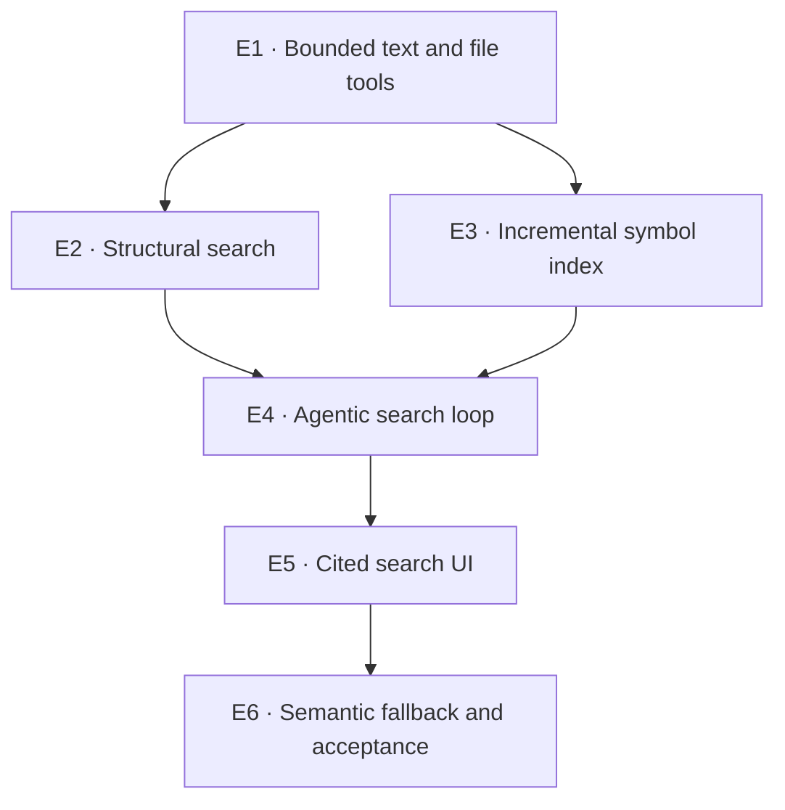

# Phase 4 — Code search

**Goal:** answer repository questions through bounded, agent-driven navigation
instead of naive top-k embedding retrieval. Every answer must cite a real
`path:line`, and every filesystem operation remains scoped to a session's
integration worktree.

The integration worktree is the search target because it is the session's
shared, reviewed code state. Searching an individual node worktree would expose
unmerged speculative edits; searching the original repository would omit work
already merged during the graph. The search vertical resolves this from
persisted session data and never imports orchestration code.

## Activities

### E1 — Bounded text and file tools ✅

Wrap ripgrep's JSON stream with `asyncio.create_subprocess_exec`, fixed result,
line-width, stderr, and wall-clock bounds. Add equally bounded `read_file` and
`list_directory` primitives. Paths are always relative to the selected
session's integration worktree, cannot escape through `..` or symlinks, and
results cite repository-relative line numbers.

**Done when:** literal and regex search, glob/case controls, no-match, malformed
pattern, truncation, timeout, binary absence, and path-escape tests pass without
blocking the event loop.

**Result:** completed on 2026-08-08. `CodeSearchService` resolves only the
persisted session integration worktree and runs ripgrep's JSON stream through
`asyncio.create_subprocess_exec`. Regex/literal mode, glob, case, and result
limit are argv data; no shell is involved. Results carry repository-relative
path, line, character column, and a width-bounded preview. The subprocess has a
five-second default timeout, bounded stderr capture, a one-megabyte stream-line
limit, and is terminated as soon as one result beyond the requested limit proves
truncation.

`read_file` and `list_directory` run their synchronous filesystem work in a
worker thread. Reads are capped by line count, returned bytes, and scanned bytes;
directory results are capped and non-recursive. Absolute paths, parent traversal,
and symlinks resolving outside the integration worktree are refused. Three
generated REST endpoints and frontend client methods expose the same types.
Focused tests use a real ripgrep process and a real Git integration worktree to
cover matching, filters, no-match, malformed regex, missing binary, timeout,
truncation, citations, file ranges, directory listing, and both escape forms.

### E2 — Structural search ✅

Add an ast-grep adapter behind the same result vocabulary. Language and pattern
are data passed as argv, never shell fragments. Missing `sg` is an explicit
capability response rather than a failed whole search service.

**Done when:** structural matches carry the same clickable path/line contract as
text matches and invalid language/pattern errors are bounded and typed.

**Result:** completed on 2026-08-08. The optional ast-grep adapter invokes
`sg run` with pattern and language as separate argv values and consumes
`--json=stream` one result at a time. It shares text search's subprocess,
timeout, stderr, result-count, preview-width, and stream-line bounds. Both tools
return the same repository-relative path, one-based line and column, and preview
contract, so citations require no structural-search-specific rendering.

The REST boundary exposes `/api/search/structural` through the generated client.
Invalid patterns or languages, oversized output, timeout, and missing `sg` remain
distinct typed capability responses; the rest of the search service stays
available when ast-grep is not installed. Deterministic fake-CLI tests verify the
exact argv, streaming JSON conversion, truncation, error text, missing binary,
and the HTTP citation shape without making ast-grep a Python or frontend
dependency.

### E3 — Incremental symbol index ✅

Use tree-sitter `tags.scm` queries to index definitions and references, with
`watchfiles` updating only changed files in the background. Persist source hash,
language, symbol, kind, path, and span in SQLite; never reindex the repository on
the request path.

**Done when:** create/change/delete events update only affected files, restart
reuses unchanged rows, and duplicate definitions remain separately citable.

**Result:** completed on 2026-08-08. A lifespan-owned background manager
discovers persisted session integration worktrees, performs the initial scan
off the event loop, and then applies `watchfiles` create/change/delete events
one path at a time. Each supported source is capped at two MiB and keyed by its
SHA-256 digest. Restart still reads hashes to detect drift, but unchanged files
reuse their rows without rerunning Tree-sitter; files with no tags also retain a
source row so an empty result is reusable rather than ambiguous.

Python, JavaScript, TypeScript, and TSX parsers ship as offline wheels. Their
repository-owned `tags.scm` queries extract definitions and call references,
avoiding the current language pack's first-use network downloads. Adding a
language therefore remains an explicit parser/query change. SQLite persists the
session, relative path, source hash, language, name, kind, definition/reference
role, and one-based span. Composite source foreign keys make replacement and
deletion file-local. `/api/search/symbols` and `/api/search/references` expose
bounded, generated citation contracts, and duplicate definitions are returned
as separate ordered matches.

### E4 — Agentic search loop ✅

Give a bounded model loop the text, structural, symbol, reference, file, and
directory tools. The model decides which evidence to gather and must return
claims linked only to citations it actually read. Tool calls, turns, bytes read,
and model tokens all have independent ceilings.

**Done when:** a multi-hop business-rule question is answered from tool evidence,
an unsupported claim is rejected, and exhausting any ceiling ends with a useful
partial result rather than an unbounded loop.

**Result:** completed on 2026-08-08. A lifespan-owned Anthropic client drives a
manual tool loop over all six repository-navigation primitives. A seventh,
strict `submit_answer` tool is the only successful exit: each atomic claim must
carry citations whose complete line ranges are present in an evidence ledger
populated exclusively by successful `read_file` results. Search previews,
symbol matches, ordinary assistant prose, malformed answers, and unread or
reversed ranges can therefore guide another turn but cannot become an answer.

Model turns, tool calls, UTF-8 tool-result bytes, and cumulative four-field
model tokens have independent configurable ceilings. Every early exit returns
its typed reason, counters, usage and the compact ranges already read, without
promoting unsupported prose. Token cost is captured against the pinned price
table during the request. The REST response and generated frontend client expose
the validated claims, citations, partial evidence and all limit/usage metadata.
Deterministic tests exercise a multi-hop business rule, reject a citation that
was never read, and independently exhaust every ceiling without contacting the
model provider.

### E5 — Cited search UI

Replace the placeholder with session selection, streaming chat, citation chips,
and a syntax-highlighted side panel. Clicking every claim opens the exact file
and line range; keyboard navigation and narrow-screen layout remain usable.

**Done when:** a response cannot render an unlinked citation, stale files are
identified, and route tests prove citation-to-snippet navigation.

### E6 — Semantic fallback and acceptance

Add sqlite-vec only as the last-resort tool the agent can choose after lexical,
structural, and symbol navigation. Chunk by symbols where available and by
bounded line windows otherwise. Exercise the full search against the AgentHub
repository and record answer/citation agreement.

**Done when:** semantic indexing is incremental, ordinary symbol questions do
not invoke it, and the committed acceptance record verifies every cited path and
line against the repository revision that was searched.

## Explicitly out of scope

Searching unmerged node worktrees, remote repositories, cross-repository global
ranking, editing code from search results, and treating embedding similarity as
evidence.
